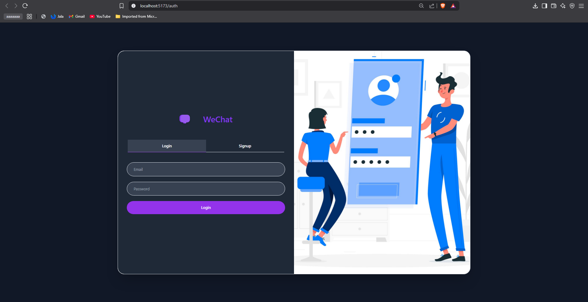
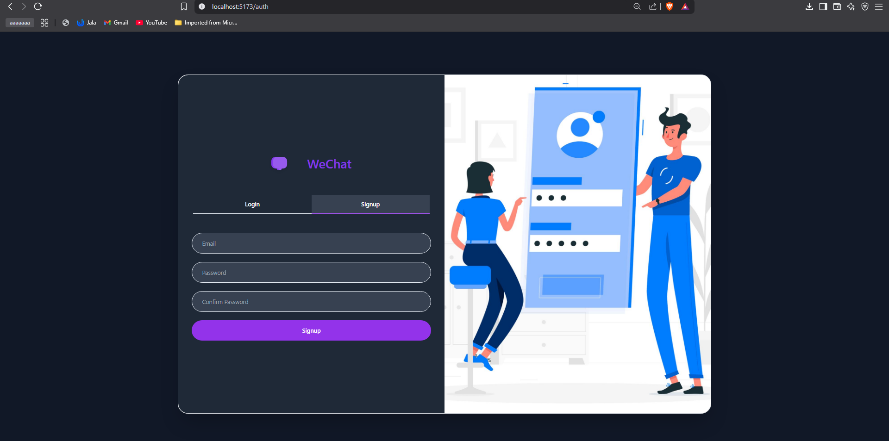
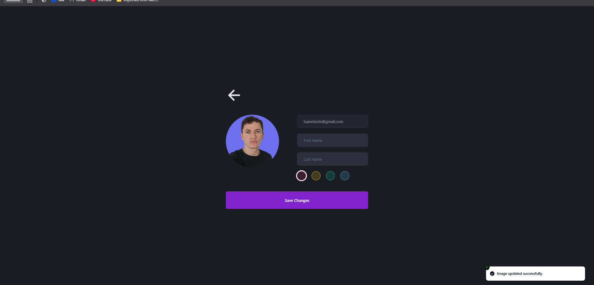
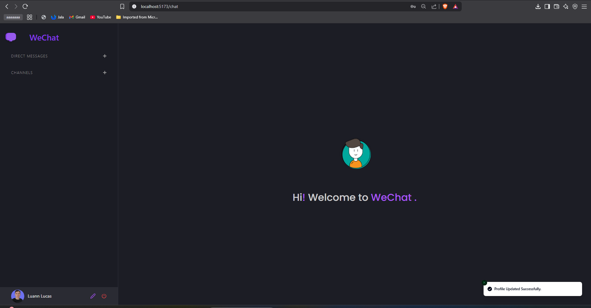
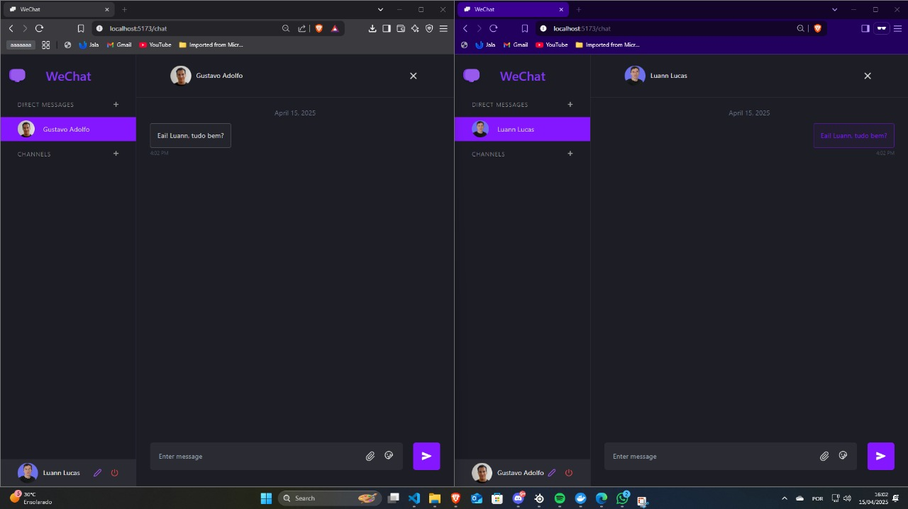
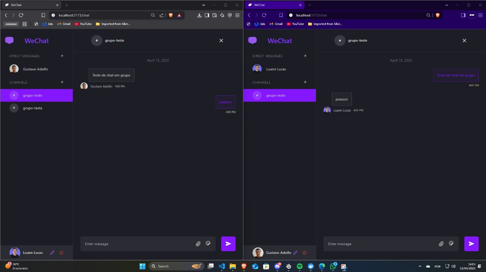

# 💬 WeChat – Aplicação de Mensagens em Tempo Real

WeChat é uma aplicação de **chat em tempo real** desenvolvida com tecnologias modernas como **Node.js**, **Socket.io**, **MongoDB** e **React**. O projeto foi idealizado para simular um ambiente robusto de comunicação instantânea, com foco em experiência do usuário, desempenho e segurança.

---

## 🚀 Sobre o Projeto

Este projeto foi desenvolvido com o objetivo de aplicar conhecimentos práticos sobre:

- Comunicação em tempo real com WebSockets
- Autenticação segura com JWT
- Estruturação de aplicações full stack modernas
- Integração entre frontend e backend

É uma excelente demonstração de como construir uma aplicação completa com troca de mensagens ao vivo.

---

## ⚙️ Funcionalidades

### ✅ Funcionais
- Registro e login com autenticação via JWT
- Envio e recebimento de mensagens em tempo real
- Histórico persistente no banco de dados
- Interface moderna e responsiva

### 📐 Não Funcionais
- Backend estruturado em arquitetura monolítica
- Utilização de HTTPS (em produção)
- Baixa latência e boa performance
---

## 🧪 Tecnologias Utilizadas

### 🔙 Backend
- Node.js + Express
- MongoDB + Mongoose
- Socket.io (WebSockets)
- JWT + Bcrypt

### 🔜 Frontend
- React + Vite
- TailwindCSS
- Socket.io-client

---

## 🧱 Estrutura do Projeto

```
client/       # Aplicação React
server/       # Backend Node.js
├── controllers/
├── models/
├── routes/
├── sockets/
└── .env
```

---

## 🧭 Como Executar o Projeto

### Pré-requisitos
- Node.js (v16+)
- Docker (opcional, para banco de dados)

### Passo a passo

```bash
# Clone o repositório
git clone https://github.com/heyluannlucas/wechat.git
cd wechat

# Instale as dependências
cd server && npm install
cd ../client && npm install

# Configure as variáveis de ambiente (.env)

# Suba o MongoDB com Docker (opcional)
docker-compose up -d

# Rode os servidores
cd server && npm run dev
cd client && npm run dev
```

---

## 🧠 Principais Aprendizados

- Como funciona o ciclo de vida de uma aplicação em tempo real
- Desafios na integração entre front e back com WebSockets
- Boas práticas de autenticação e segurança
- Criação de uma arquitetura coesa e escalável, mesmo em monólitos

---

## 📌 Diferenciais do Projeto

- Utilização completa de WebSockets via Socket.io
- Experiência realista de mensageria
- Estrutura de projeto limpa e de fácil compreensão
- Base para futuras evoluções (teste, CI/CD, escalonamento)

---

## 👥 Autor

- **Luann Lucas**


## 📚 Observações

Projeto desenvolvido com fins educacionais, como parte de um desafio prático de aplicação full stack.

## 📸 Screenshots

### Tela de Login


### Tela de Cadastro


### Tela de Perfil


### Tela Inicial


### Sala de Chat


### Chat em Grupo

---

## 🌐 Link do Repositório

[🔗 GitHub – WeChat](https://github.com/heyluannlucas/wechat)
